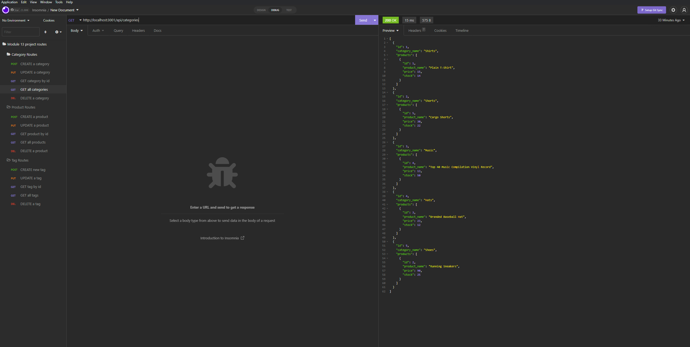

# Module 13 Ecommerce Backend Project

## Description

This is Adrian Jimenez's module 13 Ecommerce Backend challenge submission. 

I initially began this project by setting up the models the way that we were instructed to. Once completing that, I associated which models belonged to which, specifically giving products and tags a many to many relationship. Afterwards, I began working on the necessary routes for this application to work, going through and creating CRUD routes (Create, Read, Update, Delete) for every model, so that the user could preform those actions in the database. After the routes were done, I tested to make sure each worked, and set the database to sync before starting the server in server.js. Having done all that, the project was complete.

## Table of Contents

- [Installation](#installation)
- [Languages](#languages)
- [Usage](#usage)
- [Credits](#credits)
- [License](#license)
- [Contributing](#contributing)
- [Questions](#questions)

## Installation

In order to install this project, download all files and have node.js installed on your machine. Navigate to the directory in which server.js is stored in and type: 

    npm install

Once all dependencies have been downloaded, you can excecute server.js by typing npm start

## Technologies Used

* JavaScript
* Node.JS
* MySQL
* dotenv
* mysql2
* sequelize
* express.js

## Usage

* [See Video 1:](https://drive.google.com/file/d/11dzfyWaksxD-BkrZbPkMOlpr0M6Dz0rX/view?usp=sharing)

In order to use this project, please create a .env file with the appropriate variables and set up the database using the schema.sql file in the db directory. (Optionally, you can run the command "npm run schema" to run the schema file for you once .env is set up). Once that is set up, simply execute npm start and the application should start.

If you wish to seed the database, run "npm run seed"

## Credits

* Adrian Jimenez

## License

This project is licensed under the MIT License. See [LICENSE.md](./LICENSE.md) for more details.

---

## Contributing

This project follows the contributor covenant contribution guidelines. See [here](https://www.contributor-covenant.org/version/2/1/code_of_conduct/) 

## Questions

If you have any questions or concerns visit my [github](https://github.com/PuppetAJ) or send me an email at <adrianjimenez1950@gmail.com>. 

